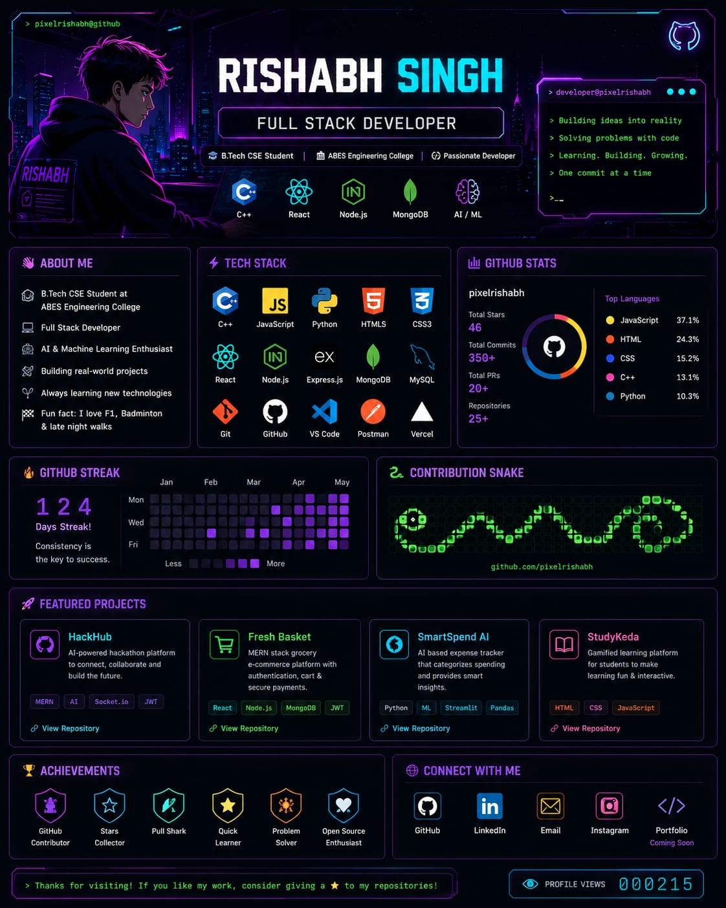

# Hi 👋 I'm Rishabh Singh

### Full Stack Developer • B.Tech CSE @ ABES Engineering College

  

  

  

  

---

# 💫 About Me

I'm a Computer Science undergraduate passionate about building software that solves real-world problems.

- 🎓 B.Tech Computer Science & Engineering, ABES Engineering College
- 💻 Full Stack Developer
- 🤖 Exploring Artificial Intelligence & Machine Learning
- ⚙️ Currently learning System Design and scalable backend architecture
- 🚀 Love turning ideas into real products

---

# 🛠 Tech Stack

---

# 📊 GitHub Analytics

  

---

# 🚀 Featured Projects

| Project | Description | Tech |
|----------|-------------|------|
| **HackHub** | AI-powered hackathon platform with team matching, mentoring, judging and networking | React • Node.js • MongoDB |
| **Fresh Basket** | MERN-based grocery e-commerce platform with authentication and admin dashboard | MERN Stack |
| **SmartSpend AI** | AI-powered expense tracker with analytics and budgeting insights | React • Express • MongoDB |
| **StudyKeda** | Gamified learning platform designed to make education more engaging | MERN Stack |

---

# 🏆 GitHub Trophies

---

# 📈 Contribution Graph

---

# 🐍 Contribution Snake

---

# 📫 Let's Connect

&nbsp;&nbsp;&nbsp;

&nbsp;&nbsp;&nbsp;

---

### 💜 Building software that creates real impact.

⭐ Thanks for visiting my profile!

